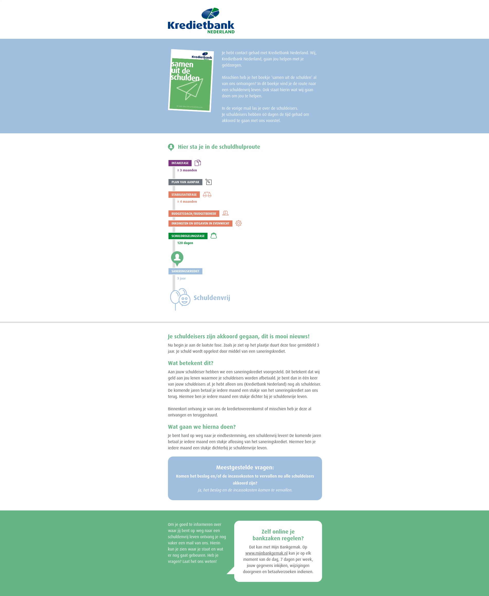

# Interactieve schuldhulpverlening

## Product

De Kredietbank Nederland wil clienten actief digitaal informeren wanneer er zich belangrijke mijlpalen hebben voorgedaan. Deze informatievoorziening moet ervoor zorgen dat de client beter inzicht krijgt in de status van de schuldregeling: wat is er gebeurt en wat gaat er nog gebeuren.

* [Dashboard](product.dashboard.yml)
* 
* [Context](context-diragram.puml)

## Proces

* [Proces](proces.bpmn)
* [Acceptatie criteria](proces.feature)

## Schuldregeling fase a

* [Proces](schuldregeling-fase-a.bpmn)
* [Acceptatie criteria](schuldregeling-fase-a.feature)

### Verstuur stabilisatie gestart mailing

[Mailing 1](mailing/emails/mailing-1/index.html) versturen op de **status A datum** van de schuldregeling wanneer de aanmaakreden van de bijbehorende case niet **Aanvraag Schuldregeling-Na extern (NA extern)** is.

| Instelling | Waarde                           |
| -----------| -------------------------------- |
| Onderwerp  | Jouw schuldhulproute             |
| Preheader  | Stabilisatiefase                 |

### Verstuur stabilisatie afgewezen mailing

::: info
Er is voor gekozen om bij een afwijzing/uitval geen bericht te sturen. Deze klanten krijgen op een andere manier bericht. 
:::

## Schuldregeling fase b

* [Proces](schuldregeling-fase-b.bpmn)
* [Acceptatie criteria](schuldregeling-fase-b.feature)

### Verstuur schuldregeling gestart mailing

[Mailing 2](mailing/emails/mailing-2/index.html) versturen op **status B datum** van de schuldregeling.

| Instelling | Waarde                           |
| -----------| -------------------------------- |
| Onderwerp  | Jouw schuldhulproute             |
| Preheader  | Schuldregelingsfase              |

### Verstuur schulden geinventariseerd mailing

[Mailing 3](mailing/emails/mailing-3/index.html) versturen op **status D datum** van de schuldregeling.

| Instelling | Waarde                           |
| -----------| -------------------------------- |
| Onderwerp  | Jouw schuldhulproute             |
| Preheader  | Schuldregelingsfase              |

### Verstuur schuldregeling voorlopig geweigerd mailing

[mailing 4b](mailing/emails/mailing-4b-geen-akkoord/index.html) versturen op de **voorlopig afgewezen datum** van de schuldregeling.

| Instelling | Waarde                           |
| -----------| -------------------------------- |
| Onderwerp  | Jouw schuldhulproute             |
| Preheader  | Geen akkoord                     |

::: info
Clienten kunnen vanuit een dwangakkoord of DFD ook nog mailingen ontvangen over een SK oF SB. Clienten ontvangen dan de bijbehorende mailingen.
:::

### Verstuur schuldregeling afgewezen mailing

::: info
Er is voor gekozen om bij een afwijzing/uitval geen bericht te sturen. Deze klanten krijgen op een andere manier bericht. 
:::

## Schuldbemiddeling

* [Proces](schuldbemiddeling.bpmn)
* [Acceptatie criteria](schuldbemiddeling.feature)

### Verstuur schuldbemiddeling gestart mailing

[mailing 4a](mailing/emails/mailing-4a-schuldbemiddeling/index.html) versturen op de **aanvraagdatum** van de schuldbemiddeling.

| Instelling | Waarde                           |
| -----------| -------------------------------- |
| Onderwerp  | Jouw schuldhulproute             |
| Preheader  | Schuldbemiddeling                |

### Verstuur hercontrole uitgevoerd mailing

[mailing 5](mailing/emails/mailing-5-1ste-hercontrole/index.html) versturen wanneer er een actie agenda taak met **Esb** of **Hsb** is uitgevoerd. 

| Instelling | Waarde                           |
| -----------| -------------------------------- |
| Onderwerp  | Jouw schuldhulproute             |
| Preheader  | Schuldbemiddeling: Hercontrole   |

::: info

* Er is ervoor gekozen om geen afwijkende hercontrole mailingen te versturen. Bij elke hercontrole wordt dezelfde mailing vertsuurd.

:::

### Verstuur schuldbemiddeling geslaagd mailing

[mailing 6a](mailing/emails/mailing-6a-schuldbemiddeling/index.html) versturen op de **einddatum** van de schuldbemiddeling waarbij de schuldbemiddeling als **geslaagd** is gemarkeerd.

| Instelling | Waarde                           |
| -----------| -------------------------------- |
| Onderwerp  | Jouw schuldhulproute             |
| Preheader  | Schuldenvrij                     |

::: info
In het tabel `ALLSBStam` staat het veld `Geslaagd` met de waarde 0 of 1.
:::

### Verstuur schuldbemiddeling mislukt mailing

::: info
Er is voor gekozen om bij een afwijzing/uitval geen bericht te sturen. Deze klanten krijgen op een andere manier bericht. 
:::

## Schuldsanering

* [Schuldsanering](schuldsanering.bpmn)
* [Acceptatie criteria](schuldsanering.feature)

### Verstuur schuldsanering gestart mailing

[mailing 4a](mailing/emails/mailing-4a-saneringskrediet/index.html) versturen op de **aanvraagdatum** van het saneringskrediet.

| Instelling | Waarde                           |
| -----------| -------------------------------- |
| Onderwerp  | Jouw schuldhulproute             |
| Preheader  | Saneringskrediet                 |

### Verstuur schuldsanering geslaagd mailing

[mailing 6a](mailing/emails/mailing-6a-saneringskrediet/index.html) versturen op de **einddatum** van het saneringskrediet wanneer de **reden van afboeking** niet in onderstaande tabel voorkomt:

| Reden                                                |
| ---------------------------------------------------- |
| Afschr.wgs.overlijden                                |
| Afschr.wgs.oninbaar > € 250,-                        |
| Afschr.tegen fin.kwyting                             |
| Afschrijven wegens WSNP                              |
| Afboeking t.l.v. het Virtueel Borgstellingsfonds     |
| Afboeking t.l.v. het Garantiefonds                   |
| Borg opgevraagd                                      |
| Kosten deurwaarder                                   |
| Afboeken Arnhem Overlijden                           |
| Afboeken Arnhem PL                                   |
| Afboeken Arnhem SHV-WSNP                             |

| Instelling | Waarde                           |
| -----------| -------------------------------- |
| Onderwerp  | Jouw schuldhulproute             |
| Preheader  | Schuldenvrij                     |

:::error

@Kersten en Dieuwke, dit wel fragiel. Zodra er een nieuwe reden toegevoegd en gebruikt gaat worden gaat het mis.

:::

## Afmelden voor mailingen use case

Een client moet zich kunnen afmelden voor een mailing. Dit kan door op een afmelden link in de mailing te klikken. De client wordt dan naar een afmeldpagina van de kredietbank geleidt. Hier krijgt de client een bevestigingstekst te zien en een afmeld knop. 

De client wordt automatisch naar een bevestiging pagina genavigeerd zodra de afmeldcode correct is geregistreerd. Hier krijgt de client een tekst te zien die bevestigd dat de afmeldcode is ontvangen.
Synion bevraagt de wachtrij op nieuwe afmeldcodes. Zodra er een nieuwe code wordt toegevoegd wordt deze door Synion verwerkt en wordt er een [bevestigingsmail naar de client verstuurd](mailing/emails/bevestiging-uitschrijving/index.html).

* [Afmelden](afmelden.puml)
* [Afmelding verwerken](afmelding-verwerken.puml)
* [Acceptatie criteria](afmelden.feature)

## Business requirements

* Er kan een afwijkende correspondentie bij de client staan opgegeven (bijvoorbeeld wanneer alle correspondentie via de gemeente gaat). Wanneer dat het geval is dan moet het email adres van de afwijkende correspondentie gebruikt worden.
* Een status kan teruggedraaid worden. Dit mag niet lijden tot het opnieuw versturen van een eerder verzonden email bericht.
* Een mailing mag alleen verstuurd worden voor nieuwe clienten (lees voorgande mailing moet verstuurd zijn).
* Een mislukte fase mag nooit resulteren in een gefeliciteerd bericht.
* Mailingen worden verstuurd vanuit shv@kbnl.nl. Deze mailbox wordt actief uitgelezen door medewerkers van de kredietbank zodat reacties op verstuurd mailingen correct afgehandeld worden.
* Clienten moeten zich kunnen afmelden voor deze mailingen.
* Een bevestiging van de afmelding moet per email verstuurd worden zodra die verwerkt is.
* De afmeldpagina mag niet geindexeerd worden door zoekmachines.
* De afmeldpagina moet een 406 statuscode retourneren wanneer er geen geldige afmeldcode is ontvangen:
    * query string parameter: **afmeldcode**
    * type: UUID

## Openstaande vragen / acties

::: error

* @Kersten / @Dieuwke, moeten NPS schuldregelingen ook meegenomen worden?
* @Kersten, hoe kan de specifieke actie agenda hercontrole taak herkent worden?
* @Hans, offerte vragen om afmeldpagina toe te voegen aan de website conform business requirements.
* @Hans, Azure storage account aanmaken voor het vastleggen van afmeldcodes.
* @Hans, is het Azure storage account vanuit de Kredietbank benaderbaar (https) of moet Centric hiervoor de firewall aanpassen?
* @Privacy, afmeldcode registratie bij Azure vastleggen in privacy dossier.

:::

